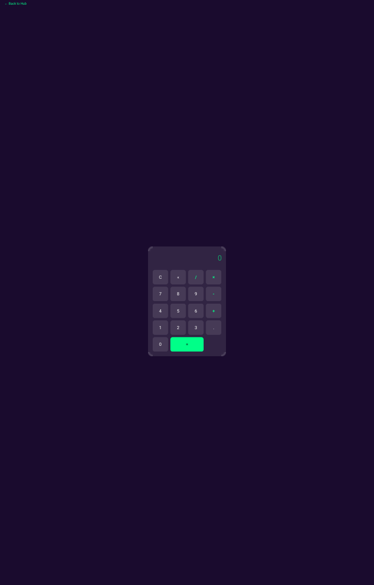
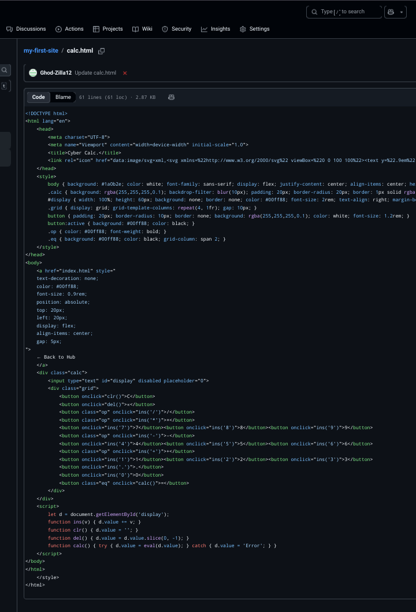
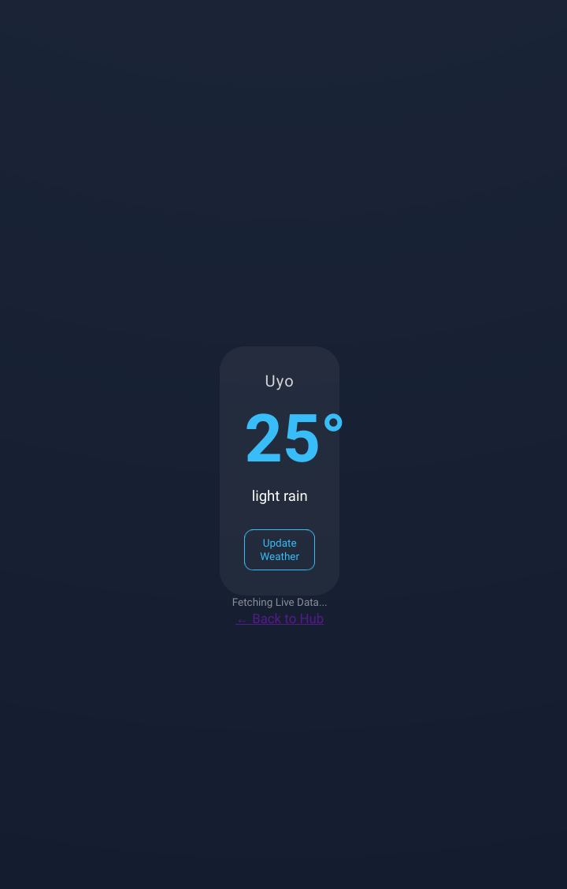
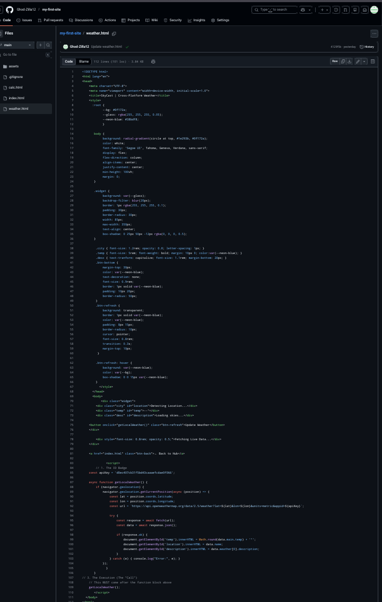

# 🚀 Dev-Hub | Ghod-Zilla12 Portfolio

A collection of high-performance, mobile-responsive web applications built with a focus on modern UI/UX, real-time API integration, and clean JavaScript logic.

---

## 🛠️ Project Showcase

### 🔢 1. PrecisionCalc (Calculator)
* **File:** `calc.html`
* **Core Tech:** JavaScript Math Logic, CSS Grid/Flexbox.
* **Functionality:** A sleek, fully functional calculator optimized for touch-screen interactions on Android and iOS.

### 🌦️ 2. SkyCast (Weather App)
* **File:** `weather.html`
* **Core Tech:** OpenWeatherMap API, Browser Geolocation API.
* **Functionality:** Automatically detects user coordinates to provide hyper-local weather data including temperature, location name, and sky conditions.
* **UI Style:** Glassmorphism with neon blue accents.

---
## 📸 Visual Previews

### 🔢 PrecisionCalc

### 🌦️ SkyCast Weather

---

## 🔗 How to Explore
1.  **Clone the Repo:** Download these files to your local environment.
2.  **Launch the Hub:** Open `index.html` to navigate between all available tools.
3.  **Permissions:** For the best experience with **SkyCast**, please allow "Location Access" when prompted by your browser.

---
**Maintained by [Ghod-Zilla12](https://github.com/Ghod-Zilla12)**
